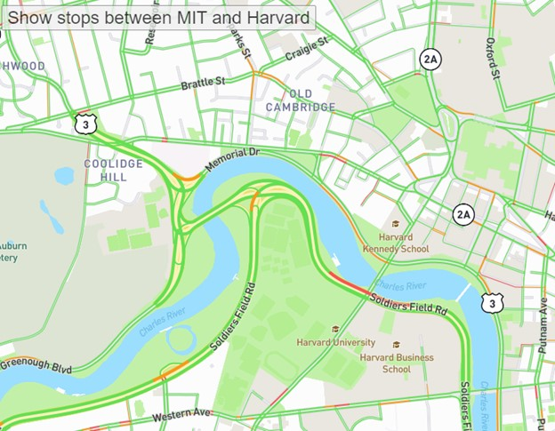
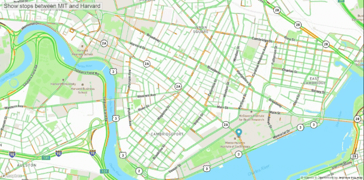

# Map-Animation

This project shows a map that tracks bus stops between MIT and Harvard, with an animation showing the route of the busline.

Languages:  Javascript, HTML, and CSS
 

## Description
This Project is a map showing bus stops between MIT and Harvard. The map is built and customized using Mapbox API. When click on the button on the top right, an animation will show with an marker the route of the bus from MIT to Harvard. 

 

## Demo

 

## How to Run
You can access this Project by clicking on this <a href="https://hujianni.github.io/Real-Time-Bus-Tracker/" target="_blank">link</a>. 
When the page is loaded, you'll see a marker originally placed on MIT. Click on the button "Show stops between MIT and Harvard", and the animation will start showing the route and stops of the shuttle bus from MIT to Harvard. 
You can restart the animation once it ends by clicking on the button again.

 

## Future improvements
- [ ] Restart the animation once user click on the button even before the end of the animation
- [ ] Have API integration with real time bus info
- [ ] Change the city and the route(s)
 

## License information
<a href="https://choosealicense.com/licenses/mit/" target="_blank">MIT</a>
